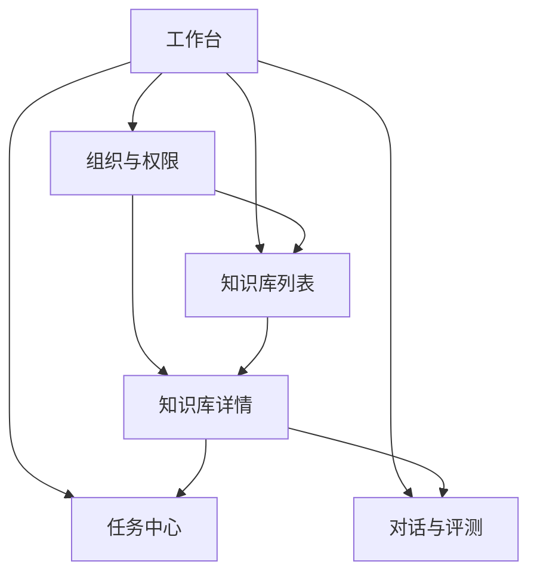

# 管理后台 V1：6 个页面低保真线框与模块布局

## 1. 说明

本文只聚焦两个目标：

- 6 个页面的低保真线框
- 每个页面的模块布局

范围限定：

- 面向 `admin` 与 `team_owner`
- 基于当前 `management` 子系统现状做 V1 收敛
- 本轮先聚焦“运营主链路”页面，不展开接口、状态机、权限细则与视觉规范

本次选定的 6 个核心页面：

1. 工作台
2. 组织与权限
3. 知识库列表
4. 知识库详情
5. 任务中心
6. 对话与评测

说明：

- `系统配置` 是明确存在的后续一级菜单，但不纳入本轮 6 页低保真范围
- 这 6 页覆盖“组织 -> 知识库 -> 文档 -> 任务 -> 对话/质量”的主运营链路

## 2. 页面关系



## 3. 页面一：工作台

### 页面目标

- 让管理员进入后台后，5 秒内知道“今天哪里有问题”
- 承担运营入口，而不是简单统计卡片页

### 页面低保真线框

```text
┌─────────────────────────────────────────────────────────────────────┐
│ 工作台 / 今日概览                                                  │
├─────────────────────────────────────────────────────────────────────┤
│ [日期范围] [组织筛选] [刷新]                         [快捷入口按钮组] │
├─────────────────────────────────────────────────────────────────────┤
│ KPI1 组织总数 │ KPI2 知识库总数 │ KPI3 文档总数 │ KPI4 运行中任务    │
│ KPI5 失败任务 │ KPI6 今日新增   │ KPI7 总存储量 │ KPI8 活跃会话数    │
├───────────────────────────────┬─────────────────────────────────────┤
│ 待处理事项                     │ 系统健康状态                        │
│ - 待解析文档                   │ - MySQL                             │
│ - 失败任务                     │ - Elasticsearch / Infinity          │
│ - 待重试任务                   │ - MinIO                             │
│ - 异常知识库                   │ - Redis                             │
├───────────────────────────────┼─────────────────────────────────────┤
│ 最近任务                       │ 热门组织 / 热门知识库               │
│ - 文档A 解析中                 │ - 组织排行                          │
│ - 文档B 失败                   │ - 知识库排行                        │
│ - 批量任务C 完成               │ - 近 7 天趋势                       │
├───────────────────────────────┴─────────────────────────────────────┤
│ 最近异常日志 / 公告 / 运维提示                                      │
└─────────────────────────────────────────────────────────────────────┘
```

### 模块布局

| 模块 | 位置 | 作用 |
|---|---|---|
| 顶部筛选区 | 顶部第一行 | 时间范围、组织范围、手动刷新 |
| KPI 指标区 | 顶部第二行 | 总览关键规模与状态 |
| 待处理事项 | 左侧主内容 | 告诉管理员现在最该处理什么 |
| 系统健康状态 | 右侧主内容 | 快速判断基础设施是否异常 |
| 最近任务 | 左下 | 承接到任务中心 |
| 热门组织/知识库 | 右下 | 给管理者运营视角 |
| 异常日志/提示 | 底部 | 运维信息与注意事项 |

## 4. 页面二：组织与权限

### 页面目标

- 让组织成为后台的第一管理对象
- 在一个页面里完成“组织、成员、归属、权限”的核心操作

### 页面低保真线框

```text
┌────────────────────────────────────────────────────────────────────────────┐
│ 组织与权限                                                                │
├────────────────────────────┬───────────────────────────────────────────────┤
│ 左侧：组织树                │ 右侧：组织详情工作区                          │
│ [搜索组织] [新建组织]       │ 组织名 / 描述 / 负责人 / 创建时间             │
│ - 集团                      │ [编辑] [删除] [创建知识库] [上传文件]         │
│   - 华东分部                ├───────────────────────────────────────────────┤
│   - 华北分部                │ Tabs                                          │
│   - 运维中心                │ [概览] [成员] [知识库] [文件] [权限]          │
│                             │                                               │
│                             │ 概览：统计卡 / 简介 / 最近操作                │
│                             │ 成员：成员表 + 添加成员 + 改角色              │
│                             │ 知识库：组织下知识库列表                      │
│                             │ 文件：组织下文件列表                          │
│                             │ 权限：角色说明 / 可见范围                     │
└────────────────────────────┴───────────────────────────────────────────────┘
```

### 模块布局

| 模块 | 位置 | 作用 |
|---|---|---|
| 组织树 | 左栏 | 组织导航与层级管理 |
| 组织操作区 | 右上 | 组织级操作入口 |
| 组织概览 | Tab 1 | 展示成员数、知识库数、文件数、负责人等 |
| 成员管理 | Tab 2 | 添加成员、移除成员、角色调整 |
| 知识库列表 | Tab 3 | 查看归属知识库，并跳详情 |
| 文件列表 | Tab 4 | 查看组织下文件，并跳任务/知识库 |
| 权限说明 | Tab 5 | 展示当前组织的角色定义和可见范围 |

## 5. 页面三：知识库列表

### 页面目标

- 以“知识库”为后台第二核心对象
- 列表页负责筛选、排序、批量操作、进入详情

### 页面低保真线框

```text
┌─────────────────────────────────────────────────────────────────────┐
│ 知识库列表                                                          │
├─────────────────────────────────────────────────────────────────────┤
│ [名称搜索] [组织筛选] [状态筛选] [创建人筛选] [刷新] [新建知识库]    │
├─────────────────────────────────────────────────────────────────────┤
│ 批量操作条： [批量删除] [批量修改权限] [批量解析]                   │
├─────────────────────────────────────────────────────────────────────┤
│ 表格                                                                │
│ 名称 | 组织 | 文档数 | Chunk数 | Token数 | 最近任务 | 状态 | 操作  │
│ KB-A | 华东 |  23   |  5300   | 1.2M    | 2失败     | 正常 | 详情  │
│ KB-B | 华北 |   8   |  1200   | 0.3M    | 运行中    | 警告 | 详情  │
├─────────────────────────────────────────────────────────────────────┤
│ 分页                                                                │
└─────────────────────────────────────────────────────────────────────┘
```

### 模块布局

| 模块 | 位置 | 作用 |
|---|---|---|
| 搜索筛选区 | 顶部 | 支撑多维过滤 |
| 新建入口 | 顶部右侧 | 创建知识库 |
| 批量操作条 | 表格上方 | 对多个知识库做运营动作 |
| 知识库表格 | 主体 | 核心浏览区 |
| 分页区 | 底部 | 大列表翻页 |

## 6. 页面四：知识库详情

### 页面目标

- 将知识库从“大列表中的一行”提升为“可管理对象”
- 让文档、解析配置、图谱、权限、评测围绕同一知识库聚合

### 页面低保真线框

```text
┌────────────────────────────────────────────────────────────────────────────┐
│ 知识库详情：KB-A                                                        │
├────────────────────────────────────────────────────────────────────────────┤
│ 标题区：名称 / 描述 / 所属组织 / 创建人 / 状态                           │
│ 操作： [编辑基本信息] [上传文档] [批量解析] [查看任务] [删除]            │
├────────────────────────────────────────────────────────────────────────────┤
│ Tabs: [概览] [文档] [解析配置] [Embedding配置] [图谱] [权限] [评测]      │
├────────────────────────────────────────────────────────────────────────────┤
│ 概览：基础统计、最近任务、最近异常、最近活跃时间                         │
│ 文档：文档列表、状态、批量重跑、查看进度                                 │
│ 解析配置：分块方式、MinerU参数、GraphRAG参数                             │
│ Embedding配置：模型、API Base、密钥状态                                  │
│ 图谱：图谱入口、社区概览、图谱状态                                        │
│ 权限：归属组织、成员权限、共享范围                                        │
│ 评测：最近运行、准确率、BLEU、ROUGE-L                                     │
└────────────────────────────────────────────────────────────────────────────┘
```

### 模块布局

| 模块 | 位置 | 作用 |
|---|---|---|
| 标题信息区 | 顶部 | 展示知识库核心属性 |
| 操作按钮组 | 顶部右侧 | 知识库级动作入口 |
| 概览 Tab | Tab 1 | 汇总统计和近期状态 |
| 文档 Tab | Tab 2 | 文档管理主战场 |
| 解析配置 Tab | Tab 3 | MinerU / Chunk / GraphRAG 配置 |
| Embedding 配置 Tab | Tab 4 | 模型与嵌入配置 |
| 图谱 Tab | Tab 5 | 图谱状态与入口 |
| 权限 Tab | Tab 6 | 可见范围和协作边界 |
| 评测 Tab | Tab 7 | 问答质量结果 |

## 7. 页面五：任务中心

### 页面目标

- 将“解析进度、失败重试、批量任务”从知识库页中抽出来
- 形成统一的任务视图

### 页面低保真线框

```text
┌────────────────────────────────────────────────────────────────────────────┐
│ 任务中心                                                                 │
├────────────────────────────────────────────────────────────────────────────┤
│ [任务类型] [状态] [组织] [知识库] [时间范围] [文档名搜索] [刷新]         │
├────────────────────────────────────────────────────────────────────────────┤
│ 状态卡片：待处理 | 运行中 | 成功 | 失败 | 已取消                         │
├────────────────────────────────────────────────────────────────────────────┤
│ 任务表                                                                    │
│ 任务ID | 文档名 | 知识库 | 类型 | 状态 | 进度 | 开始时间 | 操作         │
│ xxx    | A.pdf  | KB-A   | 解析 | 失败 | 67%  | 10:11   | 详情/重试     │
├────────────────────────────────────────────────────────────────────────────┤
│ 右侧抽屉 / 下方详情区                                                     │
│ - 任务时间线                                                              │
│ - 错误原因                                                                │
│ - 进度日志                                                                │
│ - 关联知识库                                                              │
│ - [重试] [取消] [跳转知识库]                                              │
└────────────────────────────────────────────────────────────────────────────┘
```

### 模块布局

| 模块 | 位置 | 作用 |
|---|---|---|
| 过滤器区 | 顶部 | 多维筛选任务 |
| 状态卡片 | 过滤器下方 | 快速切换状态视角 |
| 任务表格 | 主体 | 浏览任务全貌 |
| 详情抽屉 | 侧边或底部 | 查看日志、错误和操作 |
| 快捷操作 | 详情区 | 重试、取消、跳转关联对象 |

## 8. 页面六：对话与评测

### 页面目标

- 打通“用户实际使用情况”与“回答质量结果”
- 既能看对话审计，也能看评测结果

### 页面低保真线框

```text
┌────────────────────────────────────────────────────────────────────────────┐
│ 对话与评测                                                                │
├────────────────────────────────────────────────────────────────────────────┤
│ Tabs: [对话审计] [评测报表]                                               │
├────────────────────────────────────────────────────────────────────────────┤
│ 对话审计                                                                  │
│ ┌───────────────┬──────────────────────┬─────────────────────────────────┐ │
│ │ 用户列表       │ 会话列表             │ 会话详情 / 消息时间线           │ │
│ │ 搜索用户       │ 搜索会话             │ 问题 / 回答 / 引用 / 时间       │ │
│ │ 用户A          │ 会话1                │ 支持定位到知识库与文档          │ │
│ │ 用户B          │ 会话2                │                                 │ │
│ └───────────────┴──────────────────────┴─────────────────────────────────┘ │
├────────────────────────────────────────────────────────────────────────────┤
│ 评测报表                                                                  │
│ [数据集选择] [时间范围] [运行评测]                                        │
│ 指标卡：准确率 / BLEU / ROUGE-L / 样本数                                  │
│ 表格：问题 | 标准答案 | 系统答案 | 分数 | 状态                            │
└────────────────────────────────────────────────────────────────────────────┘
```

### 模块布局

| 模块 | 位置 | 作用 |
|---|---|---|
| 顶部 Tab 切换 | 顶部 | 合并对话与评测两类质量视角 |
| 用户列表 | 对话审计左栏 | 按用户定位会话 |
| 会话列表 | 对话审计中栏 | 浏览用户下的会话 |
| 会话详情区 | 对话审计右栏 | 查看消息、引用、时间线 |
| 评测控制区 | 评测报表顶部 | 数据集选择与运行入口 |
| 指标卡 | 评测报表中部 | 汇总质量指标 |
| 样本表格 | 评测报表底部 | 查看具体 QA 样本 |

## 9. 6 页的布局原则

### 统一原则

- 列表页负责筛选、批量操作、跳转
- 详情页负责对象级管理
- 大对象优先使用 `Tabs`
- 状态统一使用 `待处理 / 运行中 / 成功 / 失败 / 停用`
- 页面跳转尽量围绕对象关系展开

### 对象跳转建议

- 工作台 -> 任务中心
- 组织与权限 -> 知识库列表 / 知识库详情
- 知识库列表 -> 知识库详情
- 知识库详情 -> 任务中心
- 任务中心 -> 知识库详情 / 对话与评测
- 对话与评测 -> 知识库详情

## 10. 当前代码的落点建议

| 建议页面 | 现有代码基础 | 建议动作 |
|---|---|---|
| 工作台 | [overview/index.vue](/Users/honghaifeng/Desktop/haifeng/2026/88/ragflow-dtt/management/web/src/pages/overview/index.vue) | 保留并扩充 |
| 组织与权限 | [team-management/index.vue](/Users/honghaifeng/Desktop/haifeng/2026/88/ragflow-dtt/management/web/src/pages/team-management/index.vue) | 作为核心页继续打磨 |
| 知识库列表 | [knowledgebase/index.vue](/Users/honghaifeng/Desktop/haifeng/2026/88/ragflow-dtt/management/web/src/pages/knowledgebase/index.vue) | 拆薄，保留列表能力 |
| 知识库详情 | 同上 | 新建详情页 |
| 任务中心 | 当前分散在知识库页与文档接口中 | 新增一级页 |
| 对话与评测 | [conversation/index.vue](/Users/honghaifeng/Desktop/haifeng/2026/88/ragflow-dtt/management/web/src/pages/conversation/index.vue) | 接入菜单，并追加评测报表 |

## 11. 下一步建议

在本文之后，建议继续输出三份内容：

1. 页面级交互说明
2. 组件拆分清单
3. 路由与权限矩阵

