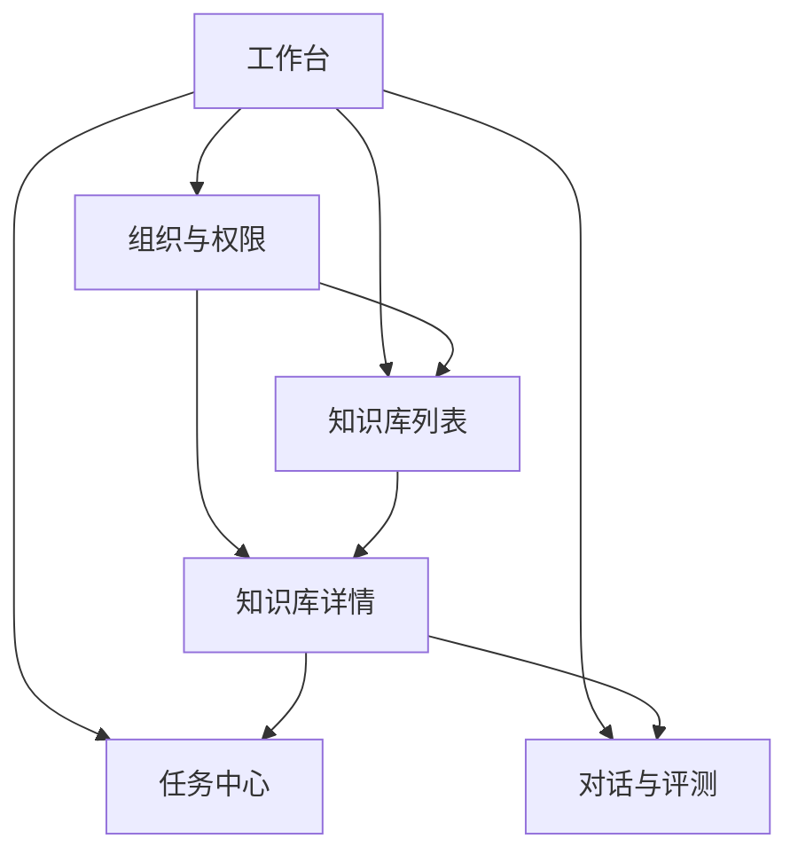
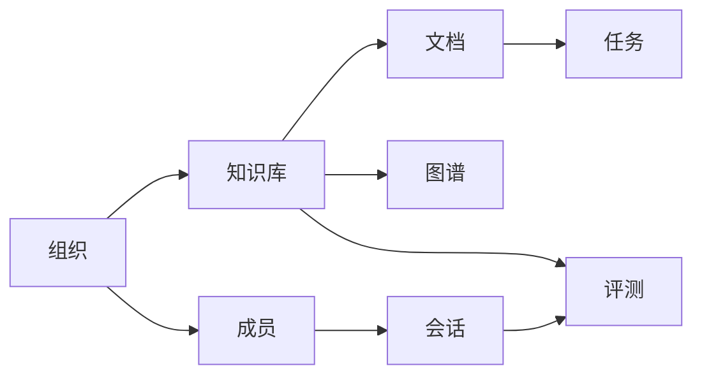

# 管理后台 V1 设计方案

## 1. 文档目的

本文用于统一管理后台 V1 的产品设计方向，先回答三个问题：

1. 管理后台应该服务谁
2. 管理后台的核心页面应该是什么
3. 每个页面在 V1 阶段应该承担什么职责

本文是设计方案文档，不是接口文档，也不是视觉稿。

本轮重点包含：

- 6 个核心页面的低保真线框
- 每个页面的模块布局
- 页面之间的关系与职责边界

## 2. 产品定位

管理后台不建议继续做成“通用 admin 模板 + CRUD 页面集合”，而应该明确定位为：

**知识运营控制台**

它服务的核心角色有两类：

- `admin`
  负责全局用户、组织、知识库、系统配置与运行状态
- `team_owner`
  负责本组织成员、知识库、文件与知识运营工作

它解决的核心问题有四类：

- 组织与权限：谁可以管理哪些知识资产
- 知识资产：知识库、文档、文件现在是什么状态
- 任务与状态：解析、入库、失败、重试是否正常
- 对话与质量：用户怎么在用、回答效果怎么样

## 3. V1 设计范围

本轮选定 6 个核心页面：

1. 工作台
2. 组织与权限
3. 知识库列表
4. 知识库详情
5. 任务中心
6. 对话与评测

不纳入本轮低保真范围但明确存在的后续页面：

- 系统配置
- 系统状态
- 模型配置
- 存储配置

## 4. 页面结构总览

### 4.1 一级菜单建议

| 一级菜单 | 说明 | V1 是否纳入本文 |
|---|---|---|
| 工作台 | 今日运营总览、异常入口 | 是 |
| 组织与权限 | 组织、成员、归属、角色 | 是 |
| 知识资产 | 知识库与文件池 | 是 |
| 任务中心 | 解析任务、失败重试、进度 | 是 |
| 对话与评测 | 会话审计与质量评估 | 是 |
| 系统配置 | 用户、模型、存储、状态 | 否 |

### 4.2 页面关系



### 4.3 对象关系



## 5. 设计原则

### 5.1 页面原则

- 列表页负责筛选、批量操作、跳转
- 详情页负责对象级管理
- 大对象优先使用 `Tabs` 承载
- 页面操作优先围绕“对象”展开，而不是围绕“表格”展开

### 5.2 信息原则

- 管理后台优先展示“异常、风险、待处理项”
- 状态字段统一命名
- 重要对象都要能跨页面跳转

建议统一状态：

- `待处理`
- `运行中`
- `成功`
- `失败`
- `停用`

### 5.3 V1 范围原则

- 先保证主链路闭环
- 不追求一开始就覆盖全部系统配置
- 优先让管理员能看清楚、管得住、查得到、重试得了

## 6. 页面一：工作台

### 6.1 页面目标

- 让管理员进入后台后，第一眼看到“今天哪里有问题”
- 承担异常入口、任务入口、业务入口

### 6.2 低保真线框

```text
┌─────────────────────────────────────────────────────────────────────┐
│ 工作台 / 今日概览                                                  │
├─────────────────────────────────────────────────────────────────────┤
│ [日期范围] [组织筛选] [刷新]                         [快捷入口按钮组] │
├─────────────────────────────────────────────────────────────────────┤
│ KPI1 组织总数 │ KPI2 知识库总数 │ KPI3 文档总数 │ KPI4 运行中任务    │
│ KPI5 失败任务 │ KPI6 今日新增   │ KPI7 总存储量 │ KPI8 活跃会话数    │
├───────────────────────────────┬─────────────────────────────────────┤
│ 待处理事项                     │ 系统健康状态                        │
│ - 待解析文档                   │ - MySQL                             │
│ - 失败任务                     │ - Elasticsearch / Infinity          │
│ - 待重试任务                   │ - MinIO                             │
│ - 异常知识库                   │ - Redis                             │
├───────────────────────────────┼─────────────────────────────────────┤
│ 最近任务                       │ 热门组织 / 热门知识库               │
│ - 文档A 解析中                 │ - 组织排行                          │
│ - 文档B 失败                   │ - 知识库排行                        │
│ - 批量任务C 完成               │ - 近 7 天趋势                       │
├───────────────────────────────┴─────────────────────────────────────┤
│ 最近异常日志 / 公告 / 运维提示                                      │
└─────────────────────────────────────────────────────────────────────┘
```

### 6.3 模块布局

| 模块 | 作用 | 优先级 |
|---|---|---|
| 顶部筛选区 | 时间范围、组织筛选、刷新 | 高 |
| KPI 指标区 | 业务规模与总体状态 | 高 |
| 待处理事项 | 告诉管理员先处理什么 | 高 |
| 系统健康状态 | 基础设施状态检查 | 高 |
| 最近任务 | 跳转任务中心 | 中 |
| 热门组织/知识库 | 运营视角 | 中 |
| 异常日志/提示 | 异常信息与提醒 | 中 |

### 6.4 输出结果

- 管理员可以快速知道当前风险点
- 所有重要异常都能一键跳转到下游页面

## 7. 页面二：组织与权限

### 7.1 页面目标

- 让组织成为后台的第一管理对象
- 在一个页面内完成组织级管理动作

### 7.2 低保真线框

```text
┌────────────────────────────────────────────────────────────────────────────┐
│ 组织与权限                                                                │
├────────────────────────────┬───────────────────────────────────────────────┤
│ 左侧：组织树                │ 右侧：组织详情工作区                          │
│ [搜索组织] [新建组织]       │ 组织名 / 描述 / 负责人 / 创建时间             │
│ - 集团                      │ [编辑] [删除] [创建知识库] [上传文件]         │
│   - 华东分部                ├───────────────────────────────────────────────┤
│   - 华北分部                │ Tabs                                          │
│   - 运维中心                │ [概览] [成员] [知识库] [文件] [权限]          │
│                             │                                               │
│                             │ 概览：统计卡 / 简介 / 最近操作                │
│                             │ 成员：成员表 + 添加成员 + 改角色              │
│                             │ 知识库：组织下知识库列表                      │
│                             │ 文件：组织下文件列表                          │
│                             │ 权限：角色说明 / 可见范围                     │
└────────────────────────────┴───────────────────────────────────────────────┘
```

### 7.3 模块布局

| 模块 | 作用 | 优先级 |
|---|---|---|
| 组织树 | 组织导航与层级操作 | 高 |
| 组织操作区 | 编辑、删除、创建知识库、上传文件 | 高 |
| 概览 Tab | 组织总体情况 | 高 |
| 成员 Tab | 成员管理与角色调整 | 高 |
| 知识库 Tab | 查看组织归属知识库 | 高 |
| 文件 Tab | 查看组织归属文件 | 中 |
| 权限 Tab | 权限说明与角色边界 | 中 |

### 7.4 设计备注

- 该页是 `team_owner` 最重要的主页面
- 推荐保留当前“左树右详情”的方向
- V1 不追求复杂权限策略编辑器，先把成员和角色关系说清楚

## 8. 页面三：知识库列表

### 8.1 页面目标

- 以“知识库”为第二核心对象
- 提供检索、筛选、批量操作和进入详情的入口

### 8.2 低保真线框

```text
┌─────────────────────────────────────────────────────────────────────┐
│ 知识库列表                                                          │
├─────────────────────────────────────────────────────────────────────┤
│ [名称搜索] [组织筛选] [状态筛选] [创建人筛选] [刷新] [新建知识库]    │
├─────────────────────────────────────────────────────────────────────┤
│ 批量操作条： [批量删除] [批量修改权限] [批量解析]                   │
├─────────────────────────────────────────────────────────────────────┤
│ 表格                                                                │
│ 名称 | 组织 | 文档数 | Chunk数 | Token数 | 最近任务 | 状态 | 操作  │
│ KB-A | 华东 |  23   |  5300   | 1.2M    | 2失败     | 正常 | 详情  │
│ KB-B | 华北 |   8   |  1200   | 0.3M    | 运行中    | 警告 | 详情  │
├─────────────────────────────────────────────────────────────────────┤
│ 分页                                                                │
└─────────────────────────────────────────────────────────────────────┘
```

### 8.3 模块布局

| 模块 | 作用 | 优先级 |
|---|---|---|
| 搜索筛选区 | 多维度过滤知识库 | 高 |
| 新建入口 | 创建知识库 | 高 |
| 批量操作条 | 多知识库操作 | 中 |
| 知识库表格 | 核心浏览区 | 高 |
| 分页区 | 翻页与规模控制 | 中 |

### 8.4 设计备注

- 该页不要承载所有知识库操作细节
- 一切重操作尽量进入详情页完成

## 9. 页面四：知识库详情

### 9.1 页面目标

- 让知识库从“列表中的一行”升级为“可管理对象”
- 把文档、配置、图谱、评测聚到一个对象上

### 9.2 低保真线框

```text
┌────────────────────────────────────────────────────────────────────────────┐
│ 知识库详情：KB-A                                                        │
├────────────────────────────────────────────────────────────────────────────┤
│ 标题区：名称 / 描述 / 所属组织 / 创建人 / 状态                           │
│ 操作： [编辑基本信息] [上传文档] [批量解析] [查看任务] [删除]            │
├────────────────────────────────────────────────────────────────────────────┤
│ Tabs: [概览] [文档] [解析配置] [Embedding配置] [图谱] [权限] [评测]      │
├────────────────────────────────────────────────────────────────────────────┤
│ 概览：基础统计、最近任务、最近异常、最近活跃时间                         │
│ 文档：文档列表、状态、批量重跑、查看进度                                 │
│ 解析配置：分块方式、MinerU参数、GraphRAG参数                             │
│ Embedding配置：模型、API Base、密钥状态                                  │
│ 图谱：图谱入口、社区概览、图谱状态                                        │
│ 权限：归属组织、成员权限、共享范围                                        │
│ 评测：最近运行、准确率、BLEU、ROUGE-L                                     │
└────────────────────────────────────────────────────────────────────────────┘
```

### 9.3 模块布局

| 模块 | 作用 | 优先级 |
|---|---|---|
| 标题信息区 | 展示知识库身份信息 | 高 |
| 操作按钮组 | 知识库级操作 | 高 |
| 概览 Tab | 汇总统计与近期状态 | 高 |
| 文档 Tab | 文档管理主战场 | 高 |
| 解析配置 Tab | MinerU / Chunk / GraphRAG 配置 | 高 |
| Embedding 配置 Tab | 模型与嵌入设置 | 中 |
| 图谱 Tab | 图谱状态与入口 | 中 |
| 权限 Tab | 协作边界与共享范围 | 中 |
| 评测 Tab | 质量结果查看 | 中 |

### 9.4 设计备注

- V1 最值得新增的一页
- 当前超大知识库页面应拆分到该详情页承载

## 10. 页面五：任务中心

### 10.1 页面目标

- 统一查看解析、批量、失败、重试相关任务
- 从知识库页剥离任务视角

### 10.2 低保真线框

```text
┌────────────────────────────────────────────────────────────────────────────┐
│ 任务中心                                                                 │
├────────────────────────────────────────────────────────────────────────────┤
│ [任务类型] [状态] [组织] [知识库] [时间范围] [文档名搜索] [刷新]         │
├────────────────────────────────────────────────────────────────────────────┤
│ 状态卡片：待处理 | 运行中 | 成功 | 失败 | 已取消                         │
├────────────────────────────────────────────────────────────────────────────┤
│ 任务表                                                                    │
│ 任务ID | 文档名 | 知识库 | 类型 | 状态 | 进度 | 开始时间 | 操作         │
│ xxx    | A.pdf  | KB-A   | 解析 | 失败 | 67%  | 10:11   | 详情/重试     │
├────────────────────────────────────────────────────────────────────────────┤
│ 右侧抽屉 / 下方详情区                                                     │
│ - 任务时间线                                                              │
│ - 错误原因                                                                │
│ - 进度日志                                                                │
│ - 关联知识库                                                              │
│ - [重试] [取消] [跳转知识库]                                              │
└────────────────────────────────────────────────────────────────────────────┘
```

### 10.3 模块布局

| 模块 | 作用 | 优先级 |
|---|---|---|
| 过滤器区 | 多维筛选任务 | 高 |
| 状态卡片 | 快速切换视角 | 高 |
| 任务表格 | 展示任务全貌 | 高 |
| 详情抽屉 | 日志、错误、进度详情 | 高 |
| 快捷操作 | 重试、取消、跳转 | 高 |

### 10.4 设计备注

- 这是 V1 最缺但最关键的后台能力
- 管理后台一旦规模化，没有任务中心会非常痛苦

## 11. 页面六：对话与评测

### 11.1 页面目标

- 打通“用户实际使用情况”和“回答质量结果”
- 同时支撑会话审计与评测视图

### 11.2 低保真线框

```text
┌────────────────────────────────────────────────────────────────────────────┐
│ 对话与评测                                                                │
├────────────────────────────────────────────────────────────────────────────┤
│ Tabs: [对话审计] [评测报表]                                               │
├────────────────────────────────────────────────────────────────────────────┤
│ 对话审计                                                                  │
│ ┌───────────────┬──────────────────────┬─────────────────────────────────┐ │
│ │ 用户列表       │ 会话列表             │ 会话详情 / 消息时间线           │ │
│ │ 搜索用户       │ 搜索会话             │ 问题 / 回答 / 引用 / 时间       │ │
│ │ 用户A          │ 会话1                │ 支持定位到知识库与文档          │ │
│ │ 用户B          │ 会话2                │                                 │ │
│ └───────────────┴──────────────────────┴─────────────────────────────────┘ │
├────────────────────────────────────────────────────────────────────────────┤
│ 评测报表                                                                  │
│ [数据集选择] [时间范围] [运行评测]                                        │
│ 指标卡：准确率 / BLEU / ROUGE-L / 样本数                                  │
│ 表格：问题 | 标准答案 | 系统答案 | 分数 | 状态                            │
└────────────────────────────────────────────────────────────────────────────┘
```

### 11.3 模块布局

| 模块 | 作用 | 优先级 |
|---|---|---|
| 顶部 Tab 切换 | 合并对话与评测视图 | 高 |
| 用户列表 | 按用户定位会话 | 高 |
| 会话列表 | 浏览用户下的会话 | 高 |
| 会话详情区 | 查看消息、引用、时间线 | 高 |
| 评测控制区 | 数据集与运行入口 | 中 |
| 指标卡 | 展示质量概览 | 中 |
| 样本表格 | 查看具体 QA 结果 | 中 |

### 11.4 设计备注

- 现有会话页已经可以成为 V1 的基础
- V1 的评测先做结果查看与触发入口，不急着做复杂配置台

## 12. 6 页之间的跳转关系

| 起点页面 | 跳转目标 | 场景 |
|---|---|---|
| 工作台 | 任务中心 | 点击失败任务、运行中任务 |
| 工作台 | 组织与权限 | 点击组织排行 |
| 工作台 | 知识库列表 | 点击知识库排行 |
| 组织与权限 | 知识库详情 | 组织下查看具体知识库 |
| 组织与权限 | 任务中心 | 查看该组织文件解析状态 |
| 知识库列表 | 知识库详情 | 列表进入对象详情 |
| 知识库详情 | 任务中心 | 查看该知识库文档任务 |
| 知识库详情 | 对话与评测 | 查看回答质量和评测结果 |
| 任务中心 | 知识库详情 | 追踪任务关联对象 |
| 对话与评测 | 知识库详情 | 追溯引用来源与知识资产 |

## 13. 与当前代码的映射建议

| 目标页面 | 当前基础页面 | 建议 |
|---|---|---|
| 工作台 | [overview/index.vue](/Users/honghaifeng/Desktop/haifeng/2026/88/ragflow-dtt/management/web/src/pages/overview/index.vue) | 保留并扩充 |
| 组织与权限 | [team-management/index.vue](/Users/honghaifeng/Desktop/haifeng/2026/88/ragflow-dtt/management/web/src/pages/team-management/index.vue) | 作为核心页继续打磨 |
| 知识库列表 | [knowledgebase/index.vue](/Users/honghaifeng/Desktop/haifeng/2026/88/ragflow-dtt/management/web/src/pages/knowledgebase/index.vue) | 拆薄，保留列表能力 |
| 知识库详情 | 同上 | 新增详情页 |
| 任务中心 | 当前分散在知识库页和文档解析流程中 | 新增一级页 |
| 对话与评测 | [conversation/index.vue](/Users/honghaifeng/Desktop/haifeng/2026/88/ragflow-dtt/management/web/src/pages/conversation/index.vue) | 接入菜单，并补评测报表 |

## 14. V1 实施建议

### 14.1 建议顺序

1. 重构菜单和路由结构
2. 拆知识库详情页
3. 新增任务中心
4. 接入对话与评测
5. 扩充工作台

### 14.2 优先完成项

- `组织与权限`
- `知识库详情`
- `任务中心`

这三项完成后，后台会从“功能页面集合”变成“可以运营知识资产的控制台”。

## 15. 后续文档建议

在本文基础上，建议继续补三份文档：

1. 页面级交互说明
2. 组件拆分清单
3. 路由与权限矩阵

